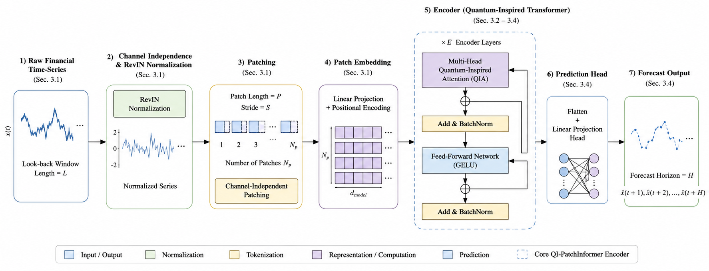
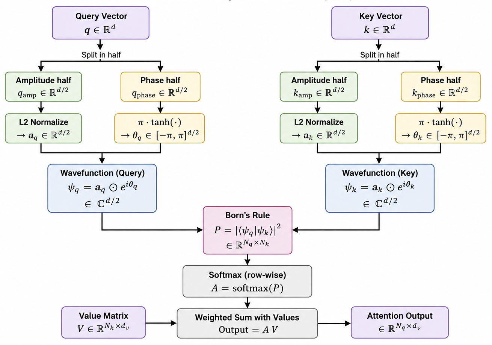
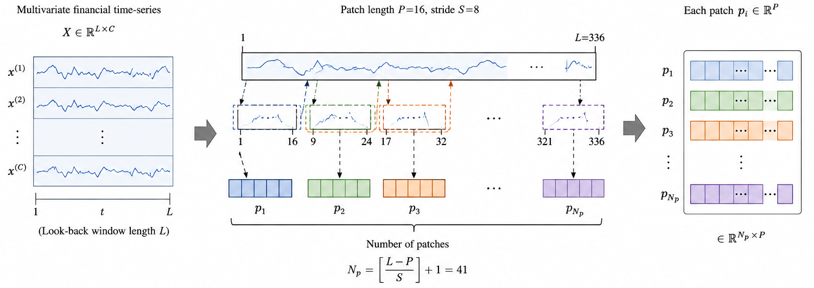
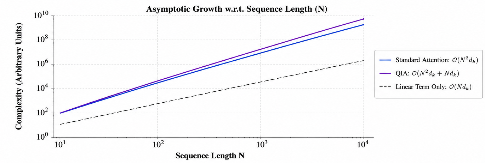

# QI-Patchformer

[](https://www.python.org/)
[](LICENSE)

## Quantum-Inspired Patch Transformer for Long-Term Financial Time-Series Forecasting

QI-Patchformer is an encoder-only Transformer architecture for long-term financial time-series forecasting. It combines the local temporal representation capabilities of patch-based Transformers with a Quantum-Inspired Attention (QIA) mechanism based on Hilbert-space representations and Born's Rule.

Unlike conventional Transformer attention, which measures query-key similarity using scaled dot products, QI-Patchformer represents queries and keys as complex-valued wavefunctions and computes their similarity using quantum transition probability.

---

## Overview

Long-term financial forecasting is challenging because financial time series are noisy, non-stationary, nonlinear, and subject to changing market regimes.

QI-Patchformer addresses these challenges by combining:

* Patch-based temporal representation learning
* Channel-independent processing
* Reversible Instance Normalization (RevIN)
* Quantum-Inspired Attention
* Hilbert-space representations
* Born's Rule similarity
* Transformer encoder architecture

### End-to-End Pipeline



The overall pipeline consists of:

```text
Raw Multivariate Financial Time Series
                |
                v
              RevIN
                |
                v
     Channel-Independent Processing
                |
                v
             Patching
                |
                v
    Patch Embedding + Positional Encoding
                |
                v
 Quantum-Inspired Transformer Encoder
                |
                v
       Linear Forecasting Head
                |
                v
        Long-Term Forecast
```

---

## Key Idea

QI-Patchformer builds on the patch-based Transformer architecture used by PatchTST while replacing conventional scaled dot-product attention with Quantum-Inspired Attention.

For every query and key representation:

1. The feature vector is divided into amplitude and phase components.
2. The amplitude component is L2-normalized.
3. The phase component is mapped to `[-π, π]`.
4. The amplitude and phase components are combined into a complex-valued wavefunction.
5. The overlap between query and key wavefunctions is calculated.
6. Born's Rule is used to obtain the attention score.
7. The resulting scores are normalized using softmax and applied to the value matrix.

The resulting attention score is:

$$
P(q,k) = |\langle \psi_q | \psi_k \rangle|^2
$$

This replaces the conventional scaled dot-product similarity used in standard Transformer attention.

### Quantum-Inspired Attention



The use of amplitude and phase allows the model to represent query-key relationships in a quantum-inspired Hilbert-space formulation while remaining fully classical in implementation.

---

## Why Patching?

Financial time series contain important local temporal patterns. Instead of processing every individual time step as a separate Transformer token, QI-Patchformer divides each channel into overlapping patches.

Given an input sequence of length `L`, patching uses:

* Patch length: `P = 16`
* Stride: `S = 8`

The effective sequence length is reduced approximately to:

$$
N \approx \frac{L}{S}
$$

This reduces the number of tokens processed by the Transformer while preserving local temporal information.

### Patch Formation



For the reported experiments:

* Look-back window: `L = 336`
* Patch length: `P = 16`
* Patch stride: `S = 8`
* Number of patches: `41`

---

## Model Architecture

QI-Patchformer follows the channel-independent, patch-based design of PatchTST.

The Transformer encoder contains:

* Multi-head Quantum-Inspired Attention
* Residual connections
* Feed-forward networks
* GELU activation
* Batch normalization
* Dropout
* Reversible Instance Normalization

The primary architectural modification is the attention mechanism. The original dot-product similarity is replaced with the proposed Born's Rule attention mechanism while the remaining PatchTST-style components are retained for controlled comparison.

---

## Computational Complexity

Standard scaled dot-product attention has the complexity:

$$
O(N^2 d_k)
$$

The proposed Quantum-Inspired Attention has the same asymptotic complexity:

$$
O(N^2 d_k)
$$

With patching, the effective complexity becomes:

$$
O\left(\left(\frac{L}{S}\right)^2 d_k\right)
$$

Therefore, QI-Patchformer does not change the asymptotic complexity class of Transformer attention.

### Complexity Comparison



Although the asymptotic complexity remains the same, Quantum-Inspired Attention introduces additional computational overhead from:

* Amplitude normalization
* Phase transformation
* Wavefunction construction
* Real and imaginary component calculations
* Additional matrix operations

In the reported Apple Silicon MPS experiments, QIA required approximately `1.4–2.4 s/epoch`, compared with `0.7–1.2 s/epoch` for standard attention.

---

# Experimental Setup

## Datasets

QI-Patchformer is evaluated on standard long-term forecasting benchmarks and real-world financial datasets.

### Benchmark Datasets

* ETTh1
* ETTh2
* ETTm1

### Financial Datasets

* S&P 500
* NIFTY 50
* AAPL
* BTC/USD

The financial datasets use daily OHLCV data with five channels:

* Open
* High
* Low
* Close
* Volume

The Close channel is used as the univariate target while all five channels are predicted jointly.

---

## Model Configuration

| Parameter               | Value |
| :---------------------- | ----: |
| Look-back window        |   336 |
| Forecast horizon        |    96 |
| Patch length            |    16 |
| Patch stride            |     8 |
| Model dimension         |    16 |
| Attention heads         |     4 |
| Encoder layers          |     3 |
| Head dimension          |     4 |
| Feed-forward dimension  |   128 |
| Encoder dropout         |   0.3 |
| Forecast head dropout   |   0.3 |
| Activation              |  GELU |
| Normalization           | RevIN |
| Optimizer               |  Adam |
| Learning rate           |  1e-4 |
| Batch size              |   128 |
| Maximum epochs          |    50 |
| Early stopping patience |    10 |

The reported benchmark QIA results use five random seeds.

---

# Results

QI-Patchformer was evaluated using Mean Squared Error (MSE), where lower values indicate better forecasting performance.

## Benchmark Results

| Dataset | Horizon |      QI-Patchformer | Informer | Autoformer | Crossformer | PatchTST |
| :------ | ------: | ------------------: | -------: | ---------: | ----------: | -------: |
| ETTh1   |      96 | **0.3781 ± 0.0024** |        — |      0.384 |       0.305 |    0.375 |
| ETTh1   |     192 | **0.4153 ± 0.0030** |        — |      0.392 |       0.352 |    0.414 |
| ETTh1   |     336 | **0.4270 ± 0.0017** |    1.128 |      0.505 |       0.440 |    0.431 |
| ETTh1   |     720 | **0.4426 ± 0.0035** |    1.215 |      0.498 |       0.519 |    0.449 |
| ETTh2   |      96 | **0.2756 ± 0.0008** |        — |      0.261 |           — |    0.274 |
| ETTh2   |     192 | **0.3389 ± 0.0009** |        — |      0.312 |           — |    0.339 |
| ETTh2   |     336 | **0.3300 ± 0.0005** |    2.723 |      0.471 |           — |    0.331 |
| ETTh2   |     720 | **0.3805 ± 0.0009** |    3.467 |      0.474 |           — |    0.379 |

## ETTm1

At a 96-step forecasting horizon:

| Dataset | Horizon |  QI-Patchformer | Informer | Autoformer | Crossformer |  PatchTST |
| :------ | ------: | --------------: | -------: | ---------: | ----------: | --------: |
| ETTm1   |      96 | 0.3032 ± 0.0016 |    0.678 |      0.481 |       0.320 | **0.290** |

## Financial Dataset Results

The financial experiments use a 96-step forecasting horizon.

| Dataset  |      QI-Patchformer |            PatchTST | Winner         | Improvement |
| :------- | ------------------: | ------------------: | :------------- | ----------: |
| S&P 500  |     0.4736 ± 0.0043 | **0.4711 ± 0.0052** | PatchTST       |       0.53% |
| NIFTY 50 |     0.3100 ± 0.0043 | **0.3067 ± 0.0055** | PatchTST       |       1.08% |
| AAPL     | **2.7517 ± 0.0216** |     2.8134 ± 0.0616 | QI-Patchformer |   **2.19%** |
| BTC/USD  | **0.9676 ± 0.0221** |     0.9711 ± 0.0157 | QI-Patchformer |   **0.36%** |

---

## Key Findings

### 1. Competitive benchmark performance

QI-Patchformer remains competitive with established Transformer-based forecasting approaches across the evaluated benchmark datasets.

### 2. Dataset-dependent performance

The effectiveness of Quantum-Inspired Attention depends on the characteristics of the underlying time series.

PatchTST performs slightly better on:

* S&P 500
* NIFTY 50

QI-Patchformer performs better on:

* AAPL
* BTC/USD

### 3. Performance on individual financial assets

QI-Patchformer achieves:

* **2.19% improvement over PatchTST on AAPL**
* **0.36% improvement over PatchTST on BTC/USD**

These results suggest that the Born's Rule similarity mechanism can be beneficial for certain individual-asset and highly volatile financial time series.

### 4. Computational trade-off

QI-Patchformer maintains the same asymptotic attention complexity as standard attention but introduces a larger constant computational cost due to the amplitude-phase formulation and wavefunction operations.

---

# Training and Evaluation

The reported implementation uses a PatchTST codebase in which the original attention mechanism is replaced with the proposed Quantum-Inspired Attention mechanism.

This allows the experiments to isolate the effect of the proposed similarity function while keeping the rest of the architecture aligned with PatchTST.

For the benchmark experiments:

* ETTh1 and ETTh2 are evaluated using five random seeds.
* The look-back window is 336.
* The forecasting horizon is 96.
* The model uses a chronological 70/10/20 train/validation/test split.

For financial datasets, daily OHLCV data is used.

---

# Repository Structure

```text
Quantum-Inspired-Patch-Transformer/
│
├── QI_PatchInformer/
│   └── ...
│
├── results/
│   └── ...
│
├── assets/
│   ├── AttentionHead.png
│   ├── ComplexityAnalysis.png
│   ├── EndtoEndPipeline.png
│   └── PatchFormation.png
│
├── .gitignore
└── README.md
```

---

# Limitations and Future Work

The current approach has several areas for further investigation:

* Larger attention heads
* Learnable amplitude-phase conversion
* Hybrid Quantum-Inspired and dot-product attention
* Ablation studies of the QIA components
* Evaluation on intraday financial data
* Evaluation on order-book data
* Reduction of the computational overhead of QIA

---

# Citation

If you use this work, please cite:

```bibtex
@article{masand2025qipatchformer,
  title   = {QI-Patchformer: A Quantum-Inspired Patch Transformer for Long-Term Financial Time-Series Forecasting},
  author  = {Masand, Harshika and Santani, Lakshya and Manek, Jugal Jeetendra and Va, Venkataramanan},
  year    = {2025},
  journal = {Procedia Computer Science}
}
```

---

# Authors

**Harshika Masand**
**Lakshya Santani**
**Jugal Jeetendra Manek**
**Venkataramanan V**

# License

The paper is published under the **CC BY-NC-ND 4.0** license.

The software license for this repository should be specified separately according to the license selected for the codebase.
